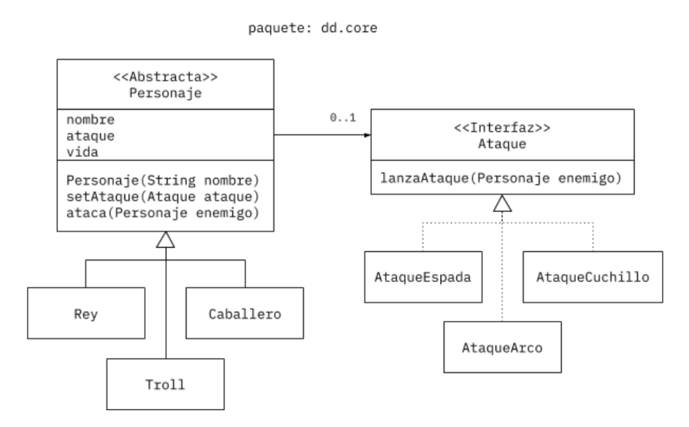

Con objeto de crear un videojuego ambientado en la épica caballeresca medieval, se
decide aplicar un patrón de diseño STRATEGY para la construcción de los personajes
y sus acciones de combate.

En el esquema adjunto se muestra la estructura de clases e interfaces que deberás
implementar en el paquete dd.core



CLASES (puedes añadir cualquier otro método que consideres):

- Personaje (**clase abstracta**)
  - Atributos:
    - nombre, ataque, salud
  - Métodos:
    - Constructor(String nombre): inicializa el atributo nombre con el argumento recibido
    - setAtaque(Ataque ataque): establece el tipo de ataque del personaje
    - ataca(Personaje enemigo) (**método abstracto**)
  - La **impresión** usará el formato:  ”[ nombre: salud ]”
- Rey:
  - inicializa la salud a 2000
  - ataca(Personaje enemigo): si tiene ataque, realiza tres ataques seguidos
- Caballero:
  - inicializa la salud a 1500
  - ataca(Personaje enemigo): si tiene ataque, realiza dos ataques seguidos
- Troll:
  - inicializa la salud a 1000
  - ataca(Personaje enemigo): si tiene ataque, realiza un ataque
- AtaqueEspada/AtaqueArco/AtaqueCuchillo:
- lanzaAtaque(Personaje enemigo):
- disminuye la salud del enemigo en un **número entero** de unidades determinado por la expresión: **acierta \* factor \* ataque** donde,
  - acierta es un número entero aleatorio en el rango [0, 1]
  - factor es un número real aleatorio en el rango [0, 1)
  - ataque es el valor entero 100 para AtaqueEspada, 50 para AtaqueArco, 25 para AtaqueCuchillo
- Imprime el mensaje “Ataque con espada/arco/cuchillo (dependiendo de la clase)” seguido por el resultado del ataque: valor numérico en que se disminuyó la salud del enemigo o texto “falla” en el caso de que acierta sea 0


**PAQUETE: dd.main CLASE PRINCIPAL: DDApp**

Con objeto de probar la jerarquía de clases anterior, se propone el desarrollo de una pequeña aplicación de consola que simulará el enfrentamiento entre un ejército de hombres y otro de trolls.


**INSTANCIAS**

El programa principal (DDApp) gestionará dos arrays, una por cada ejército, a las que se añadirán las siguientes instancias de objetos

- Hombres:


|**Tipo**|**Nombre**|**Ataque**|
| - | - | - |
|Rey|Arturo|AtaqueEspada|
|Caballero|Lancelot|AtaqueEspada|
|Caballero|Percival|AtaqueArco|
- Trolls:
- Formado por un **número aleatorio** de instancias de tipo Troll (mínimo:2, máximo: 10)
- El nombre de la instancia será: “**Troll n”**, donde n será un número de secuencia (empezando en 1)
- El tipo de ataque de cada troll también se escogerá de **forma aleatoria para cada uno** entre los diferentes tipos

**MECÁNICA DEL JUEGO**

- El juego seguirá una mecánica basada en turnos.
- En cada turno, los miembros de cada bando lanzará sus ataques sobre los miembros del otro ejército. Primero los hombres y, luego, los trolls
- En el turno de cada bando, por cada uno de sus miembros, se seleccionará un enemigo del bando contrario de forma aleatoria y le lanzará el ataque. Si, como consecuencia del ataque, la salud del contrincate quedara a un valor igual o menor que 0, se entiende que dicho personaje ha muerto y no seguirá participando.
- Los turnos se irán sucediendo hasta la finalización de la batalla. Esta finaliza cuando uno de los bandos se queda sin guerreros

**NOTA:** GENERACIÓN NÚMEROS PSEUDOALEATORIOS:


**Ejemplo de de salida generado** (se han suprimido algunos mensajes)**:**
``` 
Tal día como hoy, en una húmeda y fría mañana de finales de primavera,
la partida formada por: [[Rey Arturo], [Lancelot], [Percival]]
hallándose en los frondosos bosques del sitio de Deorham, se topó con una
patrulla de 3 de esas sanguinarias e inhumanas criaturas popularmente
conocidas como trolls.
De la batalla que aconteció, dejo aquí testimonio:
[Rey Arturo: 2000] lucha contra [Troll 3: 1000]
Ataque con espada (-75)
Ataque con espada (falla)
Ataque con espada (-34)
[Lancelot: 1500] lucha contra [Troll 1: 1000]
Ataque con espada (-81)
Ataque con espada (-92)
[Percival: 1500] lucha contra [Troll 3: 891]
Ataque con arco (falla)
Ataque con arco (-24)
[Troll 1: 827] lucha contra [Percival: 1500]
Ataque con espada (-45)
[Troll 2: 1000] lucha contra [Rey Arturo: 2000]
Ataque con cuchillo (falla)
[Troll 3: 867] lucha contra [Rey Arturo: 2000]
Ataque con cuchillo (-11)
. . .
[Rey Arturo: 1205] lucha contra [Troll 1: 120]
Ataque con espada (falla)
Ataque con espada (-65)
Ataque con espada (-58)```
[Troll 1: -3] muere!
[Lancelot: 945] lucha contra [Troll 3: 45]
Ataque con espada (falla)
Ataque con espada (-71)
[Troll 3: -26] muere!
. . .
[Rey Arturo: 1130] lucha contra [Troll 2: 312]
Ataque con espada (-24)
Ataque con espada (falla)
Ataque con espada (-78)
[Lancelot: 710] lucha contra [Troll 2: 210]
Ataque con espada (-47)
Ataque con espada (-69)
[Percival: 255] lucha contra [Troll 2: 94]
Ataque con arco (falla)
Ataque con arco (falla)
[Troll 2: 94] lucha contra [Rey Arturo: 1130]
Ataque con cuchillo (falla)
[Rey Arturo: 1130] lucha contra [Troll 2: 94]
Ataque con espada (-12)
Ataque con espada (-55)
Ataque con espada (-30)
[Troll 2: -3] muere!
Finalmente, el ejército del Rey Arturo venció!!!
Los supervivientes de la batalla fueron:
{[Rey Arturo: 1130], [Lancelot: 710], [Percival: 255]}
```

